# Picking a Direction

In order to best serve the community with technology and provide a _Palantir for the People_, we need provide a roadmap that outlines how we're going to get there, and things we need to care for along the way.

We think the safest, most effective way to get there is through becoming a cooperative business.

# Why A Cooperative Structure is Essential

The transition over time to cooperative ownership is not just an idealistic goal—it's a structural necessity for f2's mission survival. Traditional corporate structures, even with the best intentions, inevitably face pressure to prioritize investor returns over community benefit, leading to feature creep that serves paying enterprise customers, data monetization schemes, or acquisition by larger surveillance firms. A multi-stakeholder cooperative model, where users, workers, and community representatives share democratic control, creates foundational protections against mission drift while ensuring that the communities most impacted by f2's powerful capabilities have direct governance power. This isn't about rejecting growth or sustainability—it's about ensuring that as f2 scales, it remains accountable to the marginalized communities it aims to serve rather than the venture capitalists who would inevitably capture and weaponize these tools against those same communities. Cooperative ownership transforms f2 from a product that could be sold, shut down, or co-opted into community infrastructure that belongs to the people who depend on it.

# Influences

f2 is inspired by [Palantir](https://palantir.com), [Anduril](https://anduril.io), [Citizen](https://citizen.com), and [PRISM](https://wikipedia.com/wiki/PRISM_(surveillance_program)). Each of these influences are both positive and negative, some doing great work, others actively harming communities. We aim to learn from their successes and failures, design platform features influenced by them, and strive to make a platform that is truly _By the People, For the People_.

# Community Intelligence Infrastructure

We want to become a community intelligence infrastructure provider, empowering communities to be aware of the world around them, get visibility into their local environments, be able to provide support to their neighbors, and be supported in turn.

### Data Access

- **Single Flat-Fee Cooperative Membership**: One membership fee provides 100% platform access, voting rights, and ownership stake - no tiered extraction models or premium features.
- **Palantir-Level Analytical Power**: Provide communities with sophisticated data integration, correlation, and analysis capabilities previously available only to corporations and intelligence agencies
- **Community Safety Networks**: Real-time incident awareness, resource coordination, and emergency response without feeding police surveillance systems
- **Investigative Empowerment**: Enable communities to conduct deep investigations into corporate malfeasance, environmental crimes, labor violations, and systemic injustices
- **Mutual Aid Intelligence**: Data tools to identify community needs, coordinate resources, track intervention effectiveness, and strengthen solidarity networks

### Information Architecture

- **Open Source Intelligence**: Aggregate and analyze publicly available information to serve community interests rather than corporate profit. In time, and with community input, we will present options for adding commercial data pools to further the capabilities of the platform
- **Counter-Surveillance Capabilities**: Tools for communities to understand, map, and resist corporate/state surveillance efforts
- **Pattern Recognition for Liberation**: Identify patterns of systemic oppression, resource extraction, and community resilience to inform organizing strategies
- **Transparency Tools**: Make government and corporate activities more visible and accountable to affected communities

### Community Safety Without Policing

- **Harm Reduction Networks**: Coordinate community-based responses to crisis and conflict that don't rely on criminalization
- **Environmental Monitoring**: Track pollution, housing conditions, workplace safety, and other environmental justice issues affecting community health
- **Resource Mapping**: Identify and connect community assets, mutual aid networks, and solidarity economy initiatives
- **Early Warning Systems**: Alert communities to threats from evictions, ICE raids, corporate layoffs, environmental hazards, and other systemic harms
- **Digital Security**: Protect community communications and organizing infrastructure from surveillance and disruption

## Cooperative Governance and Democracy

Here are some ways we are thinking of implementing sustainability structures.

### Worker-Owned Platform Cooperativism

- **One Member, One Vote**: Flat-fee membership includes democratic voting rights on platform direction, policies, and major decisions
- **Worker-Owner Model**: Platform developers, operators, and support staff are also cooperative members with ownership stakes
- **Distributed Decision-Making**: Technical decisions made through transparent, democratic processes with community input rather than technocratic isolation
- **Community Representatives**: Formal representation for different user communities in governance structures

### Economic Justice and Sustainability

- **Sliding Scale Access**: Accessible membership fees based on ability to pay, with giftable access for those who need it and solidarity pricing for those who can contribute more
- **Community-Funded Development**: Platform development supported through member contributions, solidarity economy networks, and mission-aligned grants
- **Anti-Wealth Concentration**: Active rejection of models that concentrate wealth and power; surplus directed toward platform improvement and community support
- **Local Economic Integration**: Source services and support from worker cooperatives, community land trusts, and other solidarity economy initiatives
- **Transparent Financing**: All revenue, expenses, compensation, and financial decisions transparent to membership

### Technical Sovereignty and Independence

- **Community-Controlled Infrastructure**: Move toward community-owned hosting and technical infrastructure rather than dependence on corporate cloud providers
- **Open Source Commitment**: Maintain open source codebase to prevent vendor lock-in and enable community control & contributions
- **Resilient Design**: Build distributed systems that resist shutdown, censorship, and centralized control

## Liberation-Oriented Technology

We want to enable communities to use bleeding edge technology in a way that prioritizes their needs and safety.

### Anti-Oppression Framework

- **Centering Marginalized Voices**: Prioritize the needs and safety of communities most targeted by surveillance and oppression
- **Intersectional Analysis**: Consider how platform decisions affect different communities across lines of race, class, gender, sexuality, disability, immigration status
- **Community Self-Determination**: Support communities in defining their own safety, security, and information needs rather than imposing external frameworks
- **Accessibility First**: Ensure platform is accessible across different abilities, technological access, language backgrounds, and digital literacy levels
- **Global Solidarity**: Support global communities fighting imperialism, extraction, and authoritarian control

### Harm Reduction and Community Protection

- **De-escalation Tools**: Features designed to reduce rather than amplify conflict and community tensions
- **Privacy by Design**: Technical architecture that makes surveillance and data extraction structurally difficult and technically limited
- **Community Moderation**: Democratic processes for addressing harmful content and behavior that don't rely on centralized censorship
- **Digital Security Education**: Resources and training to help communities protect themselves from surveillance, doxxing, and digital attacks
- **Trauma-Informed Design**: Platform features designed with an understanding of how marginalized communities experience and respond to harm

### Movement Support and Organizing

- **Secure Communications**: Encrypted, surveilled-resistant communications infrastructure for organizing and mutual aid
- **Event Coordination**: Tools for organizing protests, community meetings, mutual aid distributions, and other collective actions
- **Resource Sharing**: Platforms for communities to share skills, materials, housing, transportation, and other mutual aid resources
- **Campaign Management**: Tools for running community-controlled campaigns for housing justice, environmental protection, worker organizing, etc.
- **Legal Support**: Integration with legal observers, jail support, know-your-rights resources, and community defense networks

## Implementation Principles

How we are building the platform is as important as what we are building.

### Community-Led Development

- **Start Where Communities Are**: Build incrementally from existing community needs and capacities rather than imposing technical solutions
- **User-Driven Priorities**: Feature development based on community input and organizing needs rather than technical convenience or market demands  
- **Participatory Design**: Involve community members in designing, testing, and improving platform features through democratic processes
- **Cultural Responsiveness**: Adapt platform to different cultural contexts, organizing traditions, and community communication styles
- **Iterative Improvement**: Regular community feedback cycles to continuously improve platform effectiveness and community benefit

### Sustainable Growth

- **Quality Over Quantity**: Prioritize deep community engagement and platform effectiveness over rapid user acquisition
- **Organic Expansion**: Grow through community networks and solidarity connections rather than venture capital or viral marketing
- **Capacity Building**: Invest in community digital literacy, organizing skills, and platform governance capabilities
- **Long-Term Thinking**: Make decisions based on community benefit and movement sustainability rather than short-term growth metrics
- **Mission Protection**: Maintain constitutional protections and community control even as platform grows and evolves

### Revolutionary Patience

- **Build While We Fight**: Create immediate community benefit while working toward larger systemic change
- **Prefigurative Politics**: Model the democratic, cooperative, anti-oppressive relationships we want to see in the broader society
- **Strategic Coordination**: Align platform development with broader movements for economic justice, community control, and liberation
- **Learning and Adaptation**: Continuously learn from community feedback, movement experiences, and changing conditions
- **Solidarity Economy Integration**: Connect f2 with broader networks of mutual aid, cooperative economics, and community-controlled institutions

# But How?

This is both a sprint & a marathon. It is a sprint in that we need to get this technology out _now_, but we also will have to maintain it. If you would like to see a visualization of the order of operations, you can find it at the bottom of the page!

## Development Path

### Phase 1: Prototype with Essential Features

**Build Core Community Intelligence Capabilities**
* **ICE Enforcement Tracking & Rapid Response**: Real-time identification and tracking of ICE operations, agent deployment patterns, and enforcement activities to enable community rapid response networks
  - Community-sourced incident reporting with location data and threat assessment
  - Pattern recognition for enforcement operation signatures (vehicle types, timing, locations)
  - Integration with existing rapid response networks and legal support organizations
  - Alert systems that protect reporter and community member identity
* **Community Safety Intelligence**: Broader incident awareness system for threats to community safety including law enforcement presence, harassment, and other dangers
* **Mutual Aid Resource Coordination**: Real-time mapping and coordination tools for community resources, legal support, safe houses, and rapid response capabilities
* **Basic Open Source Intelligence**: Simple data collection from publicly available sources - starting with local news, social media, and government websites to identify patterns
* **User Authentication & Management**: Account creation, community membership, role-based access controls, and basic security features
* **Email & SMS Notifications**: Alert systems using email and text messages for time-sensitive community safety information
* **Mobile-First Design**: Ensure the platform works effectively on phones since that's how community members will access it during active enforcement situations

**Identify & Define Initial Feature Set**
* Conduct community listening sessions to understand immediate needs and priorities
* Focus on features that provide immediate value while building toward larger analytical capabilities
* Establish clear boundaries for what goes into the MVP versus future releases
* Document technical architecture decisions and their alignment with cooperative principles

### Phase 2: Community Feedback and Iteration

**Establish Community Feedback Loops**
* Set up feedback channels through the platform, community calls, and direct outreach
* Create clear processes for how community input influences development priorities
* Implement quick iteration cycles to respond to urgent community needs
* Build relationships with community organizations and activist groups who can provide ongoing input

**Technical Iteration**
* Use the existing Rust microservices architecture to rapidly implement changes
* Leverage the k3s deployment in Iceland for testing new features before wider release
* Basic monitoring to understand platform usage while respecting privacy
* Implement security and privacy features based on community feedback about threats and concerns

### Phase 3: Community Governance and Legal Structure

**Community Communication and Planning**
* Develop democratic decision-making processes for major platform changes and policy decisions
* Create channels for ongoing community input on cooperative governance structure
* Establish working groups for different aspects of platform development (technical, legal, community outreach, etc.)
* Document decision-making processes and ensure they're accessible to community members with different technical backgrounds

**Legal Cooperative Formation**
* Research and establish appropriate multi-stakeholder cooperative legal structure
* Create governance documents that enshrine the principles outlined in this goals document
* Transfer code ownership and platform control to the cooperative structure
* Establish transparent financial management and decision-making processes
* Set up legal protections for the platform's mission and community-controlled nature

### Phase 4: Community-Driven Funding

**Transparent Financial Planning**
* Develop detailed budget for initial year of operations including hosting, development, legal, and community support costs
* Share financial projections and assumptions with the community for input and feedback
* Establish sliding-scale membership fee structure that balances accessibility with sustainability
* Create accountability mechanisms for how funds are used and decisions are made

**Fundraising Initiative**
* Launch fundraising campaign targeting community organizations, activist networks, and individual supporters
* Provide clear information about what the funds will support and how the platform will remain community-controlled
* Offer multiple ways to contribute including direct funding, volunteer labor, and spreading the word
* Provide regular updates on fundraising progress and how funds are being used

### Phase 5: Production Deployment

**Pre-Production Testing**
* Deploy to staging environment for community testing and final debugging
* Conduct security audits and privacy reviews with community input
* Test platform stability and performance under realistic usage conditions
* Finalize mobile app for submission to app stores with appropriate privacy and security features

**Production Launch**
* Deploy platform to production environment with full monitoring and support systems
* Launch mobile applications through app stores while maintaining direct installation options
* Implement immediate bug fix and support processes to address launch issues
* Provide community onboarding and digital security training to support platform adoption

### Phase 6: Sustainable Growth and Development

**Quality-Focused Scaling**
* Gradually expand platform access while maintaining community engagement and platform stability
* Prioritize deep community relationships over rapid user acquisition
* Invest in community digital literacy and platform training
* Monitor platform usage patterns to ensure features are serving community needs effectively

**Community-Driven Roadmap**
* Implement transparent processes for communities to request and prioritize new features
* Continue building toward full "Palantir for the People" analytical capabilities based on community input
* Expand data sources and analytical tools in response to specific community organizing and safety needs

**Long-term Sustainability**
* Establish ongoing funding through membership fees, grants, and donations
* Build partnerships with other cooperative and community-controlled technology projects
* Develop training and support systems to help communities use the platform effectively
* Continue improving governance structures to ensure democratic control as the platform grows

### Order of Operations

There is an order of operations for all of this, and much can be done in parallel! Here is a visualization that can help you understand what has to be done more clearly

```mermaid
flowchart TD
    %% Phase 1: Prototype
    A[Start Development] --> B[ICE Tracking MVP]
    A --> C[User Auth & Management]
    A --> D[Community Listening Sessions]
    
    B --> E[Basic OSINT Collection]
    C --> F[Email/SMS Notifications]
    D --> G[Feature Definition & Scope]
    
    %% Phase 2: Feedback & Iteration
    E --> H[Setup Feedback Channels]
    F --> H
    G --> H
    
    H --> I[Technical Iteration Cycles]
    H --> J[Community Relationship Building]
    
    %% Phase 3: Governance (can start in parallel with iteration)
    I --> K[Community Communication Processes]
    J --> K
    K --> L[Legal Coop Formation]
    L --> M[Code Transfer to Coop]
    
    %% Phase 4: Funding (needs governance structure)
    K --> N[Financial Planning]
    M --> O[Fundraising Campaign]
    N --> O
    
    %% Phase 5: Deployment (needs funding)
    I --> P[Pre-Production Testing]
    O --> Q[Security Audits]
    P --> R[Production Launch]
    Q --> R
    R --> S[Mobile App Store Submission]
    
    %% Phase 6: Growth
    R --> T[Gradual Scaling]
    S --> T
    T --> U[Community-Driven Roadmap]
    T --> V[Long-term Sustainability]
    
    %% Ongoing parallel processes
    J -.-> W[Ongoing Community Engagement]
    U -.-> W
    V -.-> W
    
    %% We are here indicator
    WE["🎯 WE ARE HERE"] 
    WE -.-> A
    WE -.-> B
    WE -.-> C
    WE -.-> D
    WE -.-> E
    WE -.-> F
    WE -.-> G
    WE -.-> H
    
    %% Styling
    classDef phase1 fill:#e1f5fe
    classDef phase2 fill:#f3e5f5
    classDef phase3 fill:#e8f5e8
    classDef phase4 fill:#fff3e0
    classDef phase5 fill:#fce4ec
    classDef phase6 fill:#f1f8e9
    classDef current fill:#ffeb3b,stroke:#f57f17,stroke-width:3px
    
    class A,B,C,D,E,F,G phase1
    class H,I,J phase2
    class K,L,M phase3
    class N,O phase4
    class P,Q,R,S phase5
    class T,U,V,W phase6
    class WE current
```

