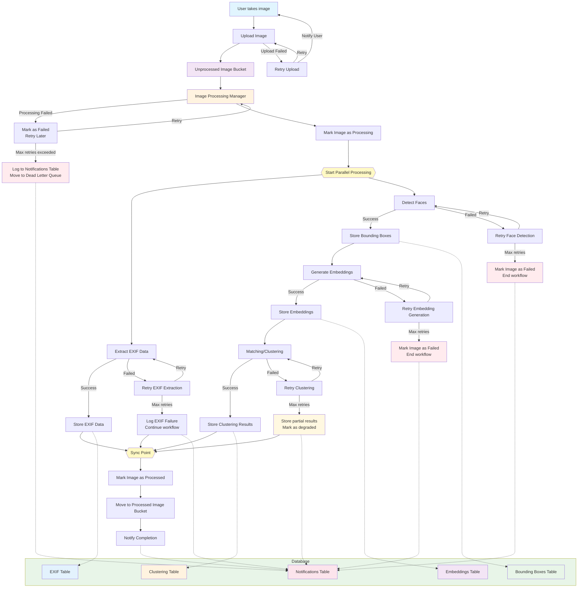

# Image Processing Pipeline

The image processing pipeline is fairly complex and requires crossing multiple service boundaries. Generically, we are extracting as much data as is possible from the image to ensure we are maximizing the opportunity for downstream correlation purposes. This workflow is designed to handle the complexity of image processing and ensure that the image is processed efficiently while making the system more robust. We can retry failures, get notifications of failures, and other monitoring features. This also lets us scale up each of the processing components independently.

